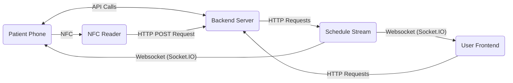
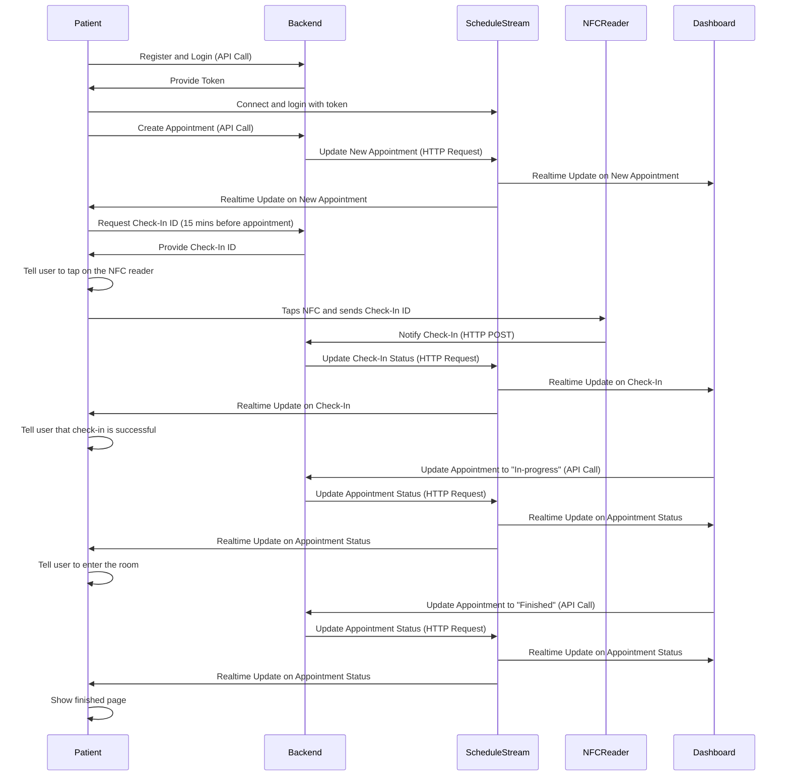

# Appoint

  
  
  
  
  

Appoint is a system of IoT devices to make it easy to arrange medical appointments.

## Batteries Included

- [`next-dashboard/`](next-dashboard/) Next.js-powered dashboard and backend
- [`nfc-backend/`](nfc-backend/) NFC reader backend code on the RPI with python
- [`flutter-app/`](flutter-app/) Flutter-powered mobile app to create appointments and emit NFC signals
- [`schedule-stream/`](schedule-stream/) A simple express server that serves a Socket.IO endpoint to be used to notify subscribers of schedule change
- [`time-faker/`](time-faker/) A simple express server that acts as a time provider that can be offsetted for testing

## Flow

- Patients registers an account through the flutter app
- Creates a new appointment
- Pick an empty schedule
- Patient physically arrive at the appointed location a few minutes before the scheduled time
- Patient scans their phone on an NFC reader provided in the physical location
- Patient waits until the doctor starts the appointment
- Patient gets into a room with the doctor

## The Architecture

Here's an overview of the components used (excluding `time-faker`)

Here's how each components interact with each other (excluding `time-faker`)

## Competition

This project is supposed to be a submission for a competition named "TURNAMEN ROBOTIK INDONESIA KETUA MPR RI 2024" in the category of creative innovations.
